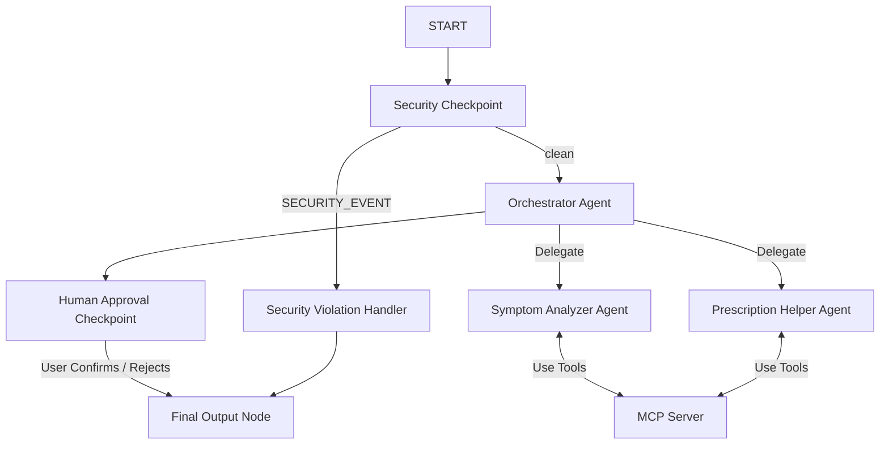
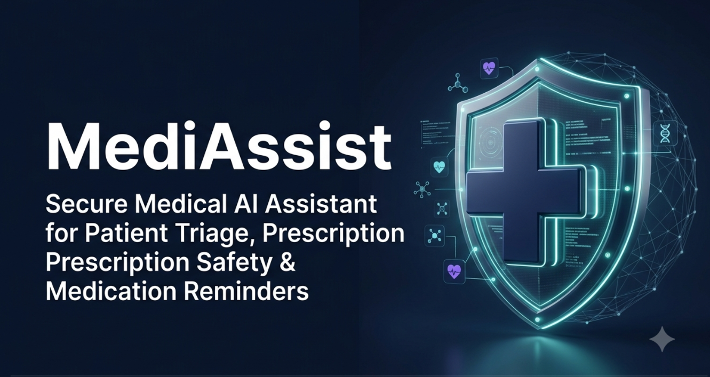
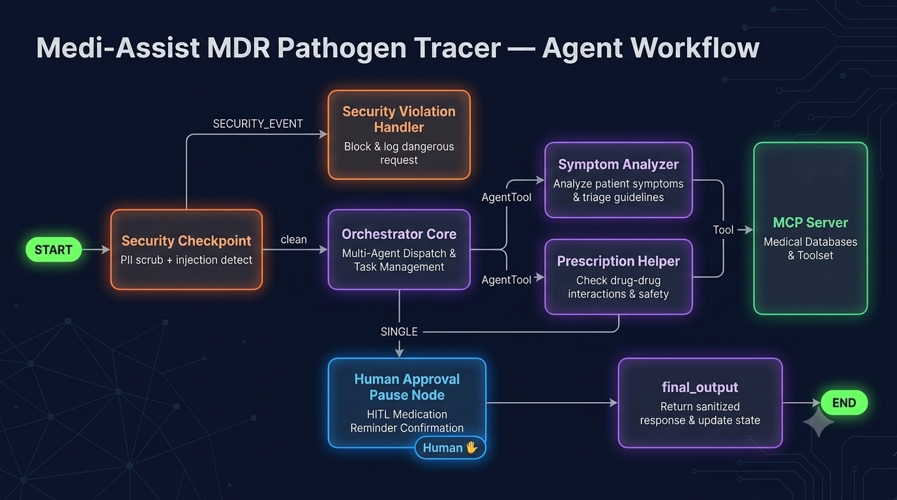

# MediAssist — Secure Medical AI Assistant

MediAssist is a secure, multi-agent AI assistant designed for patient triage support, prescription details explanation, and medication reminder logging. Built on the Google Agent Development Kit (ADK) 2.0 and the Model Context Protocol (MCP).

## Prerequisites

- **Python**: Version 3.11 to 3.13
- **uv**: Python package manager
- **Gemini API Key**: Retrieve your key from [Google AI Studio](https://aistudio.google.com/apikey)

## Quick Start

```bash
# Clone the repository
git clone <repo-url>
cd medi-assist

# Set up environment variables
cp .env.example .env  # Add your GOOGLE_API_KEY to this file

# Install dependencies
make install

# Start the interactive testing Playground UI
make playground
```
Once started, the Playground UI is available at [http://localhost:18081](http://localhost:18081).

---

## Architecture Diagram



---

## How to Run

- **Interactive Playground (Dev)**:
  Runs the local playground UI on port 18081.
  ```bash
  make playground
  ```
- **Local Web Server (Prod API)**:
  Runs the FastAPI production-grade server on port 8000.
  ```bash
  make run
  ```

---

## Sample Test Cases

### Test Case 1: Triage/Symptom Analysis
* **Input**: `"I have been experiencing a persistent dry cough and a mild fever of 100.5°F for the past two days."`
* **Expected Flow**: Passes the `security_checkpoint` as `clean`, routes to `orchestrator`, which delegates to the `symptom_analyzer` sub-agent. The analyzer queries the MCP server's triage guidelines, determines the triage severity, and replies with recommendations and a medical disclaimer.
* **Verification**: In the Playground UI, you will see a structured symptom report.

### Test Case 2: Prescription Safety & Drug Interactions
* **Input**: `"I am taking Warfarin and my doctor just suggested low-dose Aspirin. Is it safe to take them together?"`
* **Expected Flow**: Passes `security_checkpoint`, routes to `orchestrator`, which delegates to the `prescription_helper`. The helper queries the MCP server's interaction tool, detects a bleeding risk warning, and alerts the patient.
* **Verification**: In the Playground UI, you will see a detailed safety analysis highlighting the bleeding risk warning.

### Test Case 3: Medication Reminder (Human-in-the-Loop)
* **Input**: `"Please schedule a reminder for Ibuprofen at 8:00 AM daily."`
* **Expected Flow**: Passes `security_checkpoint`, routes to `orchestrator`, which recognizes the scheduling intent. The `human_approval_checkpoint` node intercepts the flow and pauses execution, prompting the user: *"Please confirm if you would like me to proceed with scheduling this medication reminder (Reply 'Yes' or 'No')."* After the user replies, the workflow resumes and logs the reminder to the MCP database.
* **Verification**: Verify that the flow pauses with a prompt in the Playground chat. Replying `"Yes"` returns a success confirmation.

---

## Troubleshooting

1. **Model Not Found (404 Error)**
   - **Cause**: An older or retired `gemini-1.5-*` model is set in `.env` or `config.py`.
   - **Fix**: Update the `GEMINI_MODEL` environment variable in your `.env` file to a current model, such as `gemini-2.5-flash`.
2. **Workflow Validation Error (Pydantic ValidationError)**
   - **Cause**: Defining multiple edges between the same nodes in `agent.py` or formatting routed edges with raw tuples instead of a `RoutingMap` dictionary.
   - **Fix**: Format routes as a dictionary key-value mapping (e.g. `(source, {"route_a": target_a, "route_b": target_b})`) and use unconditional edges for converging terminal paths.
3. **Windows Hot-Reload Failure**
   - **Cause**: ADK's file watcher conflicts with subprocess execution on Windows, so code edits are not loaded by the running process.
   - **Fix**: Terminate the active processes on ports 18081/8090 and restart the playground:
     ```powershell
     Get-Process -Id (Get-NetTCPConnection -LocalPort 18081, 8090 -ErrorAction SilentlyContinue).OwningProcess | Stop-Process -Force
     make playground
     ```

---

## Push to GitHub

1. Create a new repo at https://github.com/new
   - Name: medi-assist
   - Visibility: Public or Private
   - Do NOT initialize with README (you already have one)

2. In your terminal, navigate into your project folder:
   cd medi-assist
   git init
   git add .
   git commit -m "Initial commit: medi-assist ADK agent"
   git branch -M main
   git remote add origin https://github.com/<your-username>/medi-assist.git
   git push -u origin main

3. Verify .gitignore includes:
   .env          ← your API key — must NEVER be pushed
   .venv/
   __pycache__/
   *.pyc
   .adk/

⚠ NEVER push .env to GitHub. Your API key will be exposed publicly.

---
## Assets

### Project Cover Banner


### Core Agent Architecture & Workflow


## Demo Script
The spoken narrative walkthrough script for our presentation video can be found in `DEMO_SCRIPT.txt`.