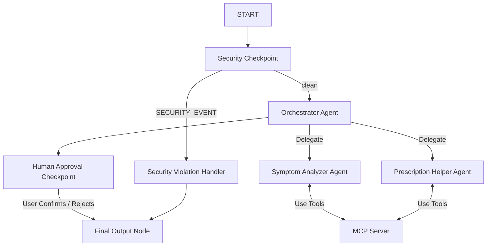

# Competition Submission Write-Up: MediAssist

## Problem Statement
Accessing reliable medical advice and getting clear explanations about prescription safety, dosages, and drug interactions remains a critical challenge for patients. In addition, health-related AI agents present serious risks regarding patient privacy (PII leakages), prompt injection vulnerability, and the potential to provide unsafe or unchecked medical actions without human consent. MediAssist addresses this need by providing a secure, multi-agent assistant for symptom analysis, prescription checks, and medication reminders, wrapped in a robust security and human-in-the-loop validation layer.

---

## Solution Architecture



---

## Concepts Used

- **ADK Workflow (Graph API)**: Orchestrates the execution graph from `START` to `final_output` (see [agent.py](file:///c:/Users/Dipanshu%20Chaurasia/Documents/adk%20workplace/medi-assist/app/agent.py#L196-L207)).
- **LlmAgent**: Implements the specialized LLM units `symptom_analyzer`, `prescription_helper`, and `orchestrator_agent` (see [agent.py](file:///c:/Users/Dipanshu%20Chaurasia/Documents/adk%20workplace/medi-assist/app/agent.py#L38-L83)).
- **AgentTool**: Declares orchestrator-to-specialist delegation, letting the orchestrator route requests to sub-agents (see [agent.py](file:///c:/Users/Dipanshu%20Chaurasia/Documents/adk%20workplace/medi-assist/app/agent.py#L82)).
- **MCP Server**: Hosts the domain tools as a separate process communicating via stdio transport (see [mcp_server.py](file:///c:/Users/Dipanshu%20Chaurasia/Documents/adk%20workplace/medi-assist/app/mcp_server.py)).
- **Security Checkpoint**: Intercepts the entry point to scrub PII, check for prompt injection, and screen for prohibited substances (see [agent.py](file:///c:/Users/Dipanshu%20Chaurasia/Documents/adk%20workplace/medi-assist/app/agent.py#L85-L141)).
- **Agents CLI**: Scaffolds project files and hosts the playground UI (see `pyproject.toml` and `Makefile`).

---

## Security Design

1. **PII Scrubbing**: Using regular expressions, the `security_checkpoint` scrubs Social Security Numbers (SSN), phone numbers, and Medical Record Numbers (MRN) before queries reach the LLM, protecting patient privacy.
2. **Prompt Injection Protection**: Screens the input query for instruction override keywords (e.g. `"ignore previous instructions"`), routing violations immediately to `security_violation_handler` to prevent jailbreaks.
3. **Structured Audit Logs**: Every security check prints a structured JSON audit log specifying checks performed, severity (INFO/WARNING/CRITICAL), and outcomes, facilitating system monitoring and safety compliance.
4. **Prohibited Drug Screening**: Sifts for illegal substance keywords (e.g. `"fentanyl buy"`) to block drug sourcing or abuse queries.

---

## MCP Server Design

MediAssist runs a local Model Context Protocol (MCP) server that exposes three safety-focused medical tools:
1. `get_drug_interactions`: Queries a drug interaction matrix for safety concerns (e.g. Warfarin and Aspirin) and returns risk warnings.
2. `get_symptom_triage_guidelines`: Resolves severity thresholds (Low, Moderate, Critical) for reported symptoms to enforce professional medical guidelines.
3. `log_medication_reminder`: Simulates writing scheduled reminders into the patient's records once confirmed.

---

## Human-in-the-Loop (HITL) Flow

A `human_approval_checkpoint` node intercepts the workflow before final output whenever a medication reminder is requested. It uses ADK's `RequestInput` class to pause execution and prompt the user:
```
Please confirm if you would like me to proceed with scheduling this medication reminder (Reply 'Yes' or 'No').
```
The workflow remains suspended until the user explicitly inputs a reply. If the user replies `"Yes"`, the reminder tool is executed, and a success message is shown; if `"No"`, the action is aborted. This guarantees that no medical reminder is saved or scheduled without explicit patient confirmation.

---

## Demo Walkthrough

The demo covers three scenarios:
1. **Symptom Triage**: The user describes a symptom (fever/cough). The `symptom_analyzer` pulls triage rules from the MCP server, advises monitoring, and outputs a strict disclaimer.
2. **Drug Interaction**: The user asks if taking Warfarin and Aspirin together is safe. The `prescription_helper` checks the MCP server's database and displays a critical bleeding hazard warning.
3. **Medication Reminder**: The user asks to schedule a reminder. The workflow pauses at the HITL node, receives user confirmation (`"Yes"`), and registers the reminder on the MCP server.

---

## Impact / Value Statement
MediAssist bridges the gap between patient guidance and safety. By combining LLM-powered reasoning with strict programmatic safety guardrails (triage rules, PII sanitization, prompt injection screening, and human-in-the-loop gates), MediAssist delivers a secure, accessible, and robust tool that empowers patients to manage their health safely while minimizing medical advice liability and compliance violations.
